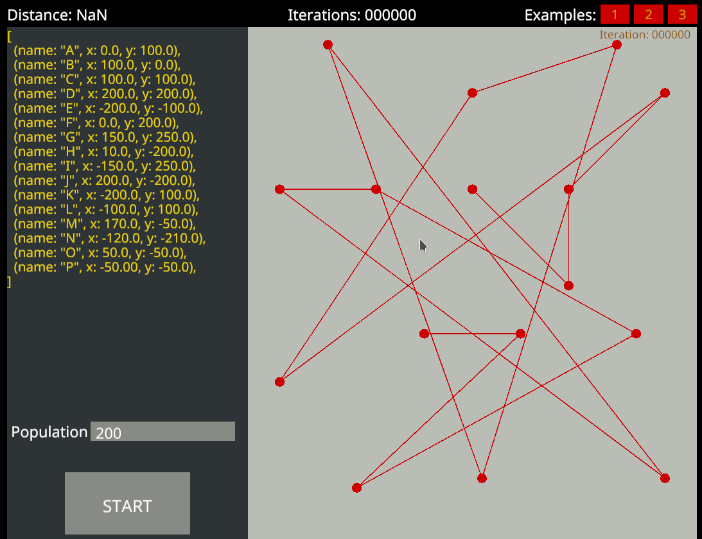

# tsp-sim

A Travelling Salesman Problem simulator and solver.

It currently implements a genetic algorithm to search for the solution.



## Building from source

### Requirements

  - The Rust programming language compiler and toolchain:
  https://www.rust-lang.org/learn/get-started

  - If you are on Windows, you will need to install the Visual Studio C/C++ Build Tools before installing Rust:
  https://visualstudio.microsoft.com/thank-you-downloading-visual-studio/?sku=BuildTools&rel=16 

### Clone and build this project:
```
git clone https://github.com/nettok/tsp-sim.git
cd tsp-sim
cargo build --release
```

`cargo` is the Rust package manager and build tool.

When building, make sure to use the `--release` flag, or otherwise the built binary will be unoptimized, and the
simulation will run extremely slow. :snail:

### Run it:
```
./target/release/tsp-sim-gui
```

It is also possible to build and run the project with a single cargo command:
```
cargo run --release
```
